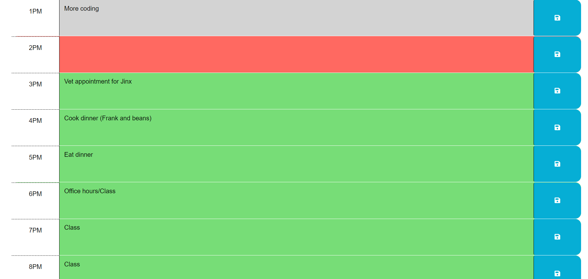

# Calendar Application

## Link to deployed website: https://wasmunlb.github.io/calender/

## Description

For assignment 5 I made an application that can be used to plan and schedule your day. Anyone with a busy schedule can tell you how hard it can be to stay organized with their schedule. With this application you can enter all the events you have planned for the day, and you can reference it at any time to keep you on schedule. 

The calendar spans the hours of 9am to 10pm, since these are typically my personal "buisness hours". You are able to save any inputs you make to the calendar. The hour that it currently is will be highlighed red, while the past hours are grey, and the upcoming hours are green.

This application uses two third party APIs. The first API used is jquery. At first using jquery felt a bit awkward, but I grew to like it; espically because their documentation is very useful and easy to use. The other API I used for this assignment was dayjs. I had no issues using dayjs for this assignment.

My biggest takeaways from this assignment (and what caused me the most headaches) was local storage. I ran into many bugs when it came to local storage. Initially I had a bug that caused my inputs in local storage to read "undefined". After going back to drawing board (and with the help of ask bcs) I then implemented my logic to include the use of the "this" object with jquery to select my inputs. I then got my app running smoothly shortly after.

## Usage

The use of this application is very simple. All you need to do is:
-Go to the deployed website
-Enter your schedule for the day
-Click on the save buttons for each hour time slot
-If you refresh the page (or leave and come back), all your inputs will still be there. (Unless you cleared your browser cache)

Attached is a picture of a typical schedule.

## License

The MIT license was used for this assignment.